Demos
=====

This is where everything that doesn't fit into examples goes.  Basically
a free for all of me experimenting and having fun.

ESC will exit all of them.

Flying controls = 6DOF flying controls a la 
[Descent](https://en.wikipedia.org/wiki/Descent_(video_game)).
Mouse + WASDQE + LShift + Space

If you run any of these and they don't look like the screenshots and you can't
figure out why, please let me know by opening an issue, thanks!

## Building

Same as the examples.

### Grass

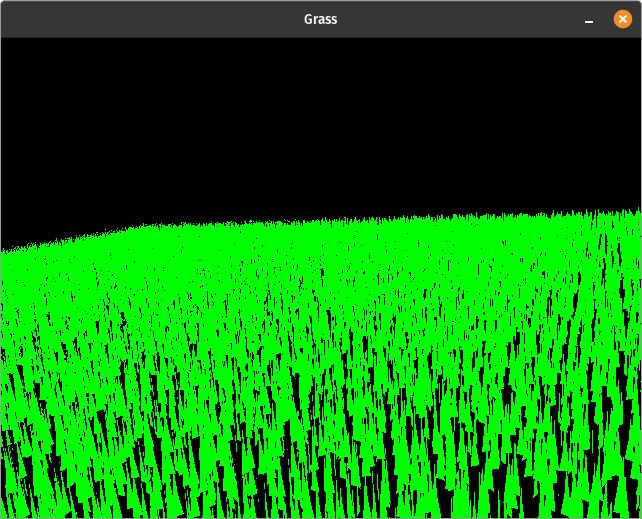

This is an incomplete port of the instanced rendering
[grass demo](https://github.com/rswinkle/oglsuperbible5/blob/1a92eb6b4eeb665582acd69bc41ba793ff974bd1/Src/Chapter12/Grass/Grass.cpp)
from Superbible 5.  Flying controls.

### Modelviewer

This demonstrates gouraud and phong shading with a single directional light.  It will load one of the models in ./media/models if it's passed
as a command line argument, otherwise it generates a sphere.  The model then rotates counter clockwise.  's' and 'p' to switch between shaders
and polygon modes.  The program assimp_convert will, if you have libassimp installed and can compile it, convert other model formats to the plain
text format modelviewer reads.  Be aware you might have to scale and translate them to make them visible.  The stanford models provided are
already centered.

### Multidraw

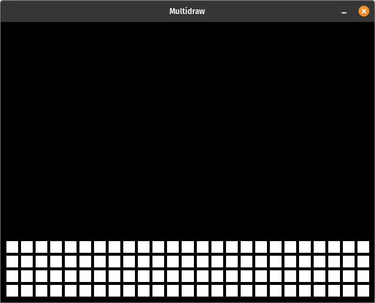
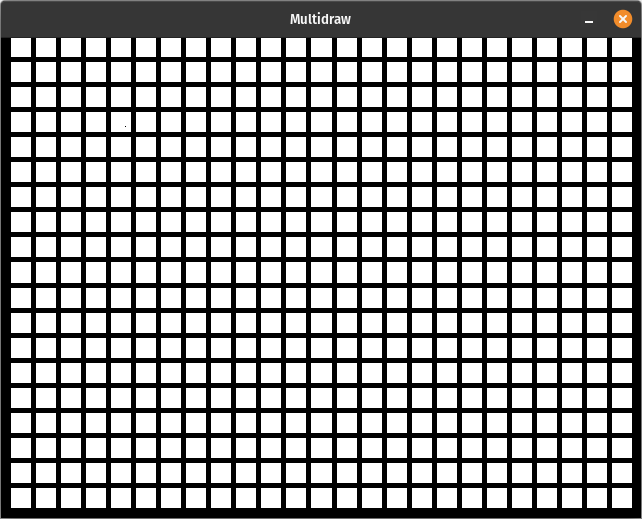

This is a very simple demo to show how to use glMultiDrawArrays and glMultiDrawElements with PGL and
how they differ slightly (specifically Elements) from regular OpenGL.  Compare with the same program
[in opengl_reference](https://github.com/rswinkle/opengl_reference/blob/master/src/multidraw.cpp).  Hit 'e' to switch
between DrawArrays and DrawElements, 'p' to change polygon modes.

### Texturing

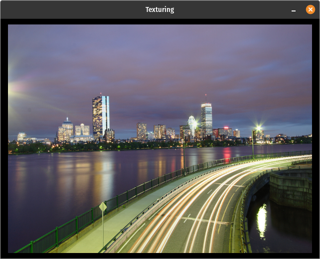

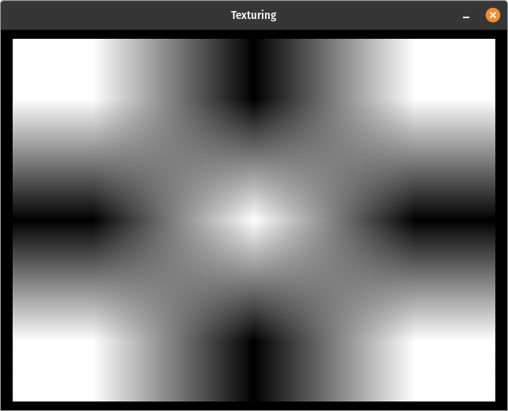
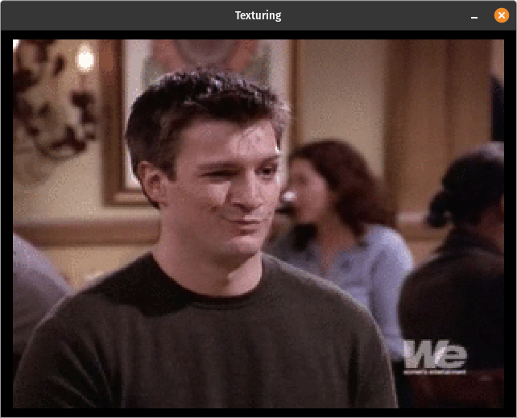

What it says on the tin.  Arrow keys to zoom/rotate, 1 to switch between 5 textures, 'f' to switch between GL_NEAREST and GL_LINEAR. Note,
PortableGL doesn't actually use min_filter.  You can set it, but only mag_filter is used in all the texel access functions.
The fourth texture is a texture array (a GIF of Nathan Fillion from "Two Guys and a Girl" if you were wondering).
The last texture is a GL_TEXTURE_RECTANGLE, though obviously there's no visible difference, just making sure
it works.

If you define PGL_HERMITE_SMOOTHING before including PortableGL in your program, the linear filtering will look like
the 4th picture above rather than the 3rd. As you can see, the increased smoothness is obvious on a 3x3 texture but
I doubt it would be very noticeable for most textures, especially in interactive programs. Even if it were noticeable,
the slight difference probably isn't worth the slight drop in framerate.

### Pointsprites

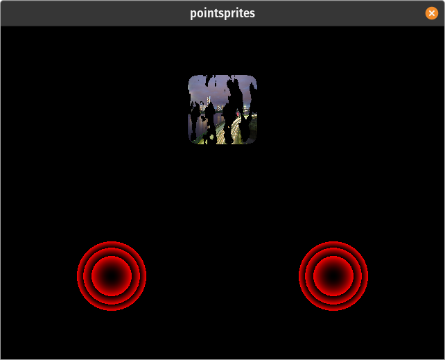

This draws 3 large pointsprites, making 2 targets using 1 shader, and creating a disolving textured point with a different shader that shows
how multitexturing works.  There is no glActiveTexture or texture units in PortableGL.  Shaders access textures by the handles
returned from glGenTextures.  It's much more convenient imo.

### Cubemap

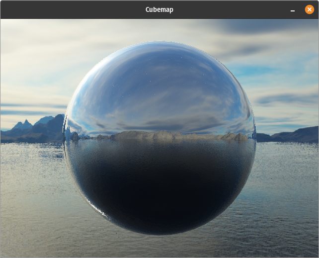

This uses a cubemap texture to create the reflective sphere + skybox demo.  Flying controls.

### Sphereworld

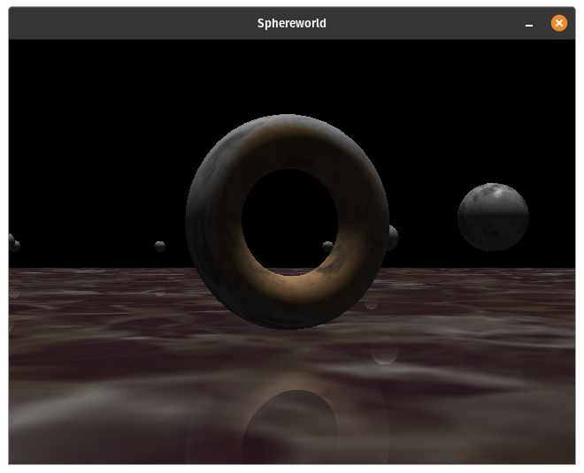

Another demo from [Superbible 5](https://github.com/rswinkle/oglsuperbible5/blob/1a92eb6b4eeb665582acd69bc41ba793ff974bd1/Src/Chapter05/Sphereworld/Sphereworld.cpp)
but with better controls and a slightly different shader and light direction.  The controls are shown in the terminal on startup (read from a config file
the default being qwerty_controls.config, but you can pass an argument to select another file like dvorak_controls.config, or edit qwerty to suit your liking).
This is also, along with swrenderer, one of 3 current demos that show one way to resize the window, by calling pglResizeFramebuffer so the resolution always
matches the window size.  The other simpler, more performant way, is to let SDL2 scale for
you like I do with shadertoy and raytracing_1weekend.

### Sphereworld Color

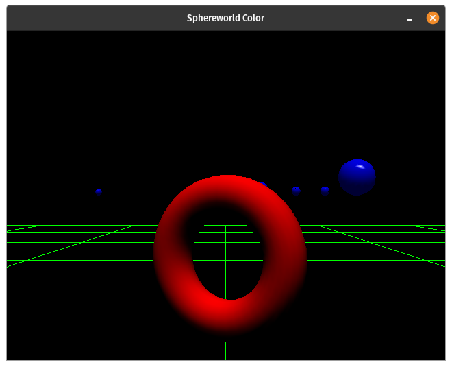

Similar to Sphereworld, but with fewer, hard coded controls (just 6DOF + mouse + tilt), and using colors not textures naturally.  This one does let you switch
between gouraud and phong shading, with the semi-interesting result that the latter actually has better performance.

### GLM Sphereworld Color

Identical to Sphereworld Color except demoing using the OpenGL Mathematics library (GLM) (included in the repo) instead of my
own C++ math library rsw_math.

### Shadertoy

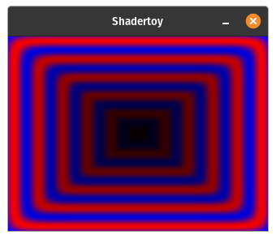
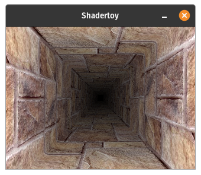
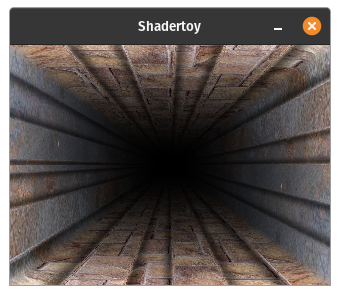
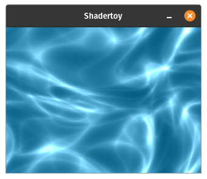
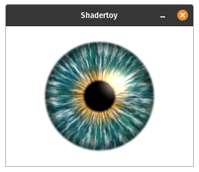
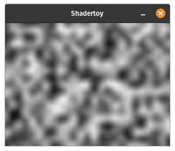
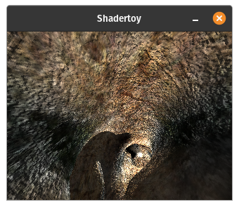
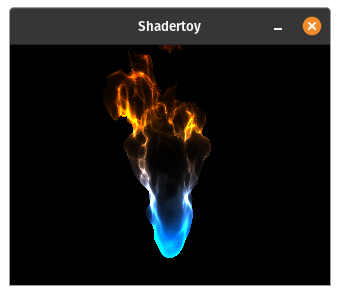

This is basically a standalone reimplementation of the graphical component of [shadertoy.com](https://www.shadertoy.com/).
Use the left and right arrow keys to cycle through 11 different shaders, roughly in order of increasing complexity and
decreasing performance.  I include links/attribution in the comments above the shaders taken directly from shadertoy.com
if you want to see them in their full glory.

Originally, it used the normal method of drawing 2 triangles that fill the screen (and you can still see that code commented out)
but making this in PortableGL meant I could add an extension, pglDrawFrame(), for this special use case that
bypasses the vertex shader entirely and just sets everything up the way shadertoy shaders need things.  Unfortunately, it doesn't
increase frame rate as much as I'd hoped so I ended up changing the resolution to 320x240 get "bearable" framerates on the harder shaders.
Even so, the last few shaders can hardly be called "realtime".  Also the tunnel light one seems to have some graphical bug, or the slow FPS just
makes it look wrong.

Since 320x240 is so small, especially on high-DPI monitors, I made this one resizable but unlike Sphereworld, where
I change the framebuffer (and the projection and glViewport) to match, here I just let SDL2 scale the texture; it's slower
than leaving the window at the small size but *much* faster than actually rendering at a higher resolution.

Also, if you want to play with a real standalone shadertoy (with live updating) that uses actual OpenGL and hardware acceleration, here are
[two](https://github.com/rswinkle/shadertoy) [options](https://github.com/githole/Live-Coder).

### Swrenderer

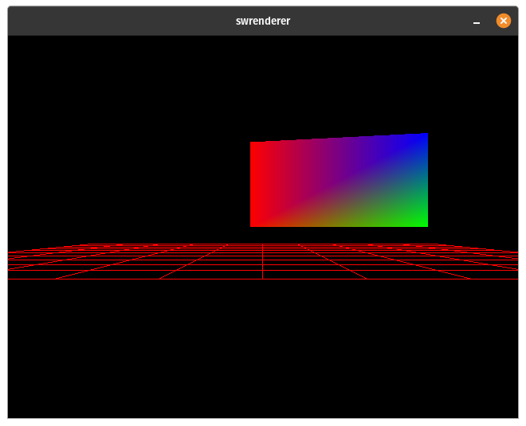
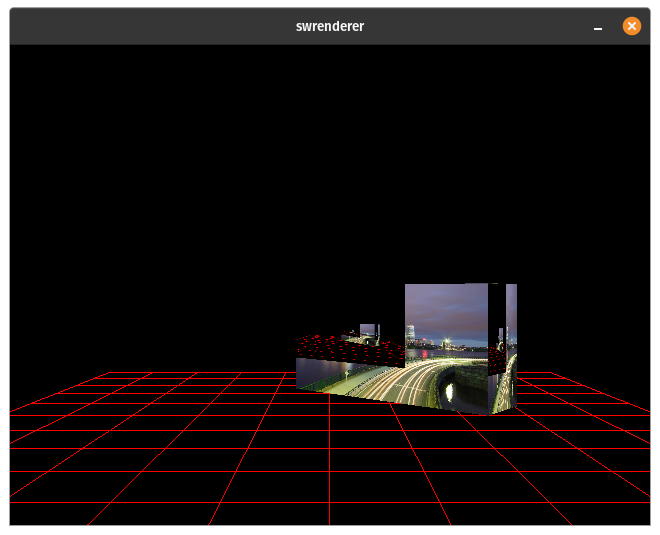

I need to think of a better name for this.  This dates back to the *very* beginning (summer 2011) of this project, based off of a tutorial.  That's why it's main.cpp.
Basically, for the longest time this was where I tested each new feature I added.  So this has interpolation, textures, depth test toggle, and a pseudo-
render to texture that's really just an extra manual copy via TexSubImage2D after the first pass.  There are also multiple methods of doing things
commented out.  Same controls as Sphereworld and 1 to switch between textures (only seen when you're using the texture shader, switched to with 's').

By default it loads qwerty_controls.config but you can pass it an argument for a different config file (I use the included dvorak_controls.config).

### SDL_Renderer Dear ImGui

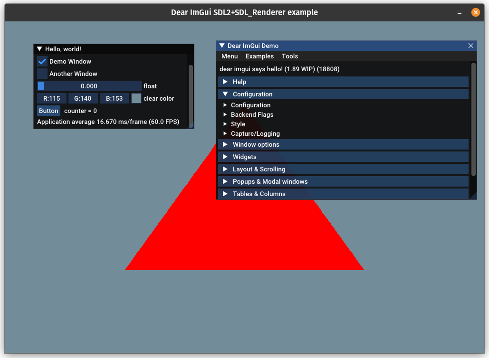

This shows how you can use Dear ImGui's SDL_Renderer backend with PortableGL.  It is literally their example program for that backend with
PortableGL tacked on, just drawing a triangle to show it works and using the clear color from the GUI for the glClear call.  See
the code and comments for more details.

### Raytracing_1weekend

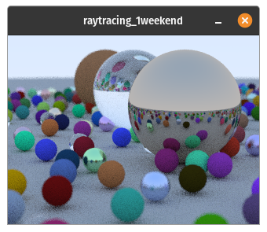

This is an adaptation of the code from ["Ray Tracing In One Weekend"](https://raytracing.github.io/) book to PortableGL, using the same pglDrawFrame extension
I use for shadertoy.  Mostly I just did it for fun since I've never written
a raytracer but I plan to continue playing with it, cleaning it up, and
moving useful pieces (with my own changes/preferences) into crsw_math and rsw_math.

Currently there are no controls (yet) but there are optional command line args to control
the number of samples and the max depth of reflection recursion.  They default to 25
and 12 respectively, for "decent" 0.2 FPS on my desktop.

