Examples
========

Different collections of sample programs, some original, lots of ports. Also I
shamelessly borrowed the table format and organization from the excellent
[raylib](https://github.com/raysan5/raylib/tree/master/examples) library I can
only aspire to raylib's polish.

## Building

They all require SDL2 to be installed to build.

On Debian/Ubuntu based distributions you can install SDL2 using the following command:

`sudo apt install libsdl2-dev`

On Mac you can download the DMG file from their [releases page](https://github.com/libsdl-org/SDL/releases/tag/release-2.32.10) or install it through
a package manager like [Homebrew](https://brew.sh/), [MacPorts](https://ports.macports.org/), or [Fink](https://www.finkproject.org/).  Note, I do
not own a mac and have never tested PortableGL on one.  Worst case, you can always just compile SDL2 from source but one of the above options should work.

On Windows you can grab the zip you want from the same releases page linked above.

I use premake generated makefiles that I include in the repo which I use on Linux. I have used these same Makefiles
to build under [MSYS2](https://www.msys2.org/) on Windows. However, at least for now, even though PortableGL and all the
examples and demos are cross platform, I don't officially support building them on other platforms. I've thought about
removing the premake scripts from the repo entirely and just leaving the Makefiles to make that clearer but decided not to
for the benefit of those who want to modify it for themselves to handle different platforms and build systems. For now
the win32 backend examples will have to suffice.

Once you have SDL2 installed you should be able to cd into each subdirectory and run `make` or `make config=release` for optimized builds.
`make verbose=1` will let you see all the build steps. You can run `make help` to see all the individual targets.

### Original Custom Examples

The exercises are a small collection demonstrating the basics in C and C++ and how to use the built in shader library.
The C++ versions use own rsw_math rather than glm like most of the other C++ examples. The rest are just whatever
makes its way over here from demos as I polish them up.

|  example  | image  | last version updated | original developer |
|-----------|--------|:-----------------------:|:----------------------|
| [ex1.c](original/ex1.c) |  | 0.100.0 | [Robert Winkler](https://github.com/rswinkle) |
| [ex2.c](original/ex2.c) |  | 0.100.0 | [Robert Winkler](https://github.com/rswinkle) |
| [ex3.c](original/ex3.c) |  | 0.100.0 | [Robert Winkler](https://github.com/rswinkle) |
| [ex1.cpp](original/ex1.cpp) |  | 0.100.0 | [Robert Winkler](https://github.com/rswinkle) |
| [ex2.cpp](original/ex2.cpp) |  | 0.100.0 | [Robert Winkler](https://github.com/rswinkle) |
| [ex3.cpp](original/ex3.cpp) |  | 0.100.0 | [Robert Winkler](https://github.com/rswinkle) |
| [ex1_std_shaders.c](original/ex1_std_shaders.c) |  | 0.100.0 | [Robert Winkler](https://github.com/rswinkle) |
| [ex2_std_shaders.c](original/ex2_std_shaders.c) |  | 0.100.0 | [Robert Winkler](https://github.com/rswinkle) |

### Classic Ports

Ports of classic OpenGL programs/demos

|  example  | image  | last version updated | original developer |
|-----------|--------|:-----------------------:|:---------------------:|
| [gears](classic/gears.c) | 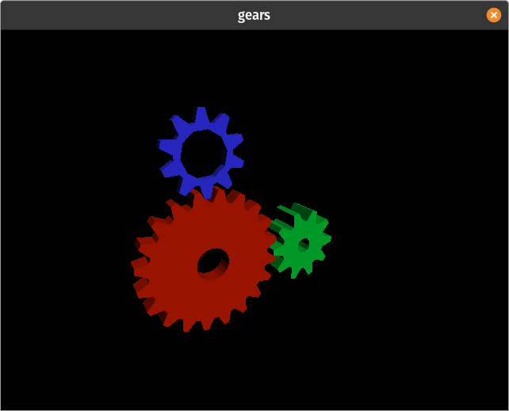 | 0.100.0 | [Robert Winkler](https://github.com/rswinkle) |

### Learning WebGL ports

Ports of lessons from [learningwebgl.com](https://learningwebgl.com/blog/?page_id=1217) based
off of my own ports to OpenGL 3.3 [here](https://github.com/rswinkle/opengl_reference).

|  example  | image  | last version updated | original developer |
|-----------|--------|:-----------------------:|:----------------------|
| [lesson1](webgl_lessons/lesson1.cpp) | 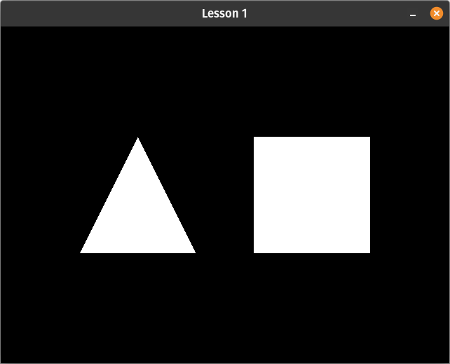 | 0.100.0 | [Robert Winkler](https://github.com/rswinkle) |
| [lesson2](webgl_lessons/lesson2.cpp) | 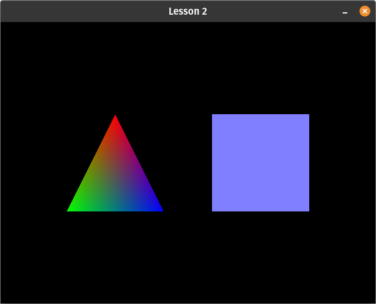 | 0.100.0 | [Robert Winkler](https://github.com/rswinkle) |
| [lesson3](webgl_lessons/lesson3.cpp) | 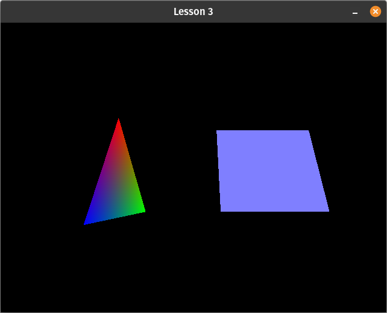 | 0.100.0 | [Robert Winkler](https://github.com/rswinkle) |
| [lesson4](webgl_lessons/lesson4.cpp) | 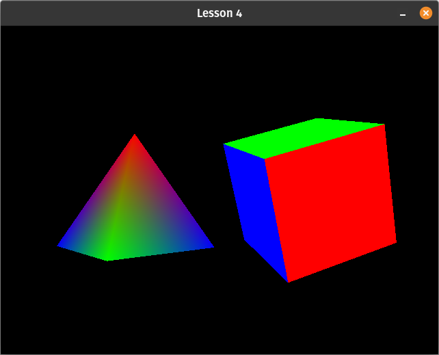 | 0.100.0 | [Robert Winkler](https://github.com/rswinkle) |
| [lesson5](webgl_lessons/lesson5.cpp) | 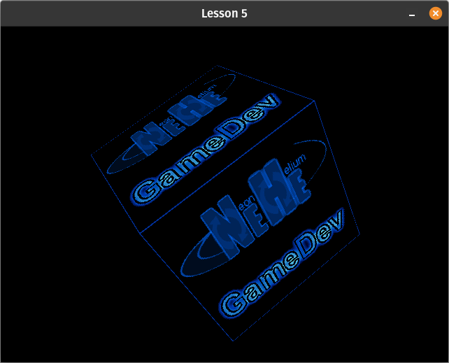 | 0.100.0 | [Robert Winkler](https://github.com/rswinkle) |
| [lesson6](webgl_lessons/lesson6.cpp) | 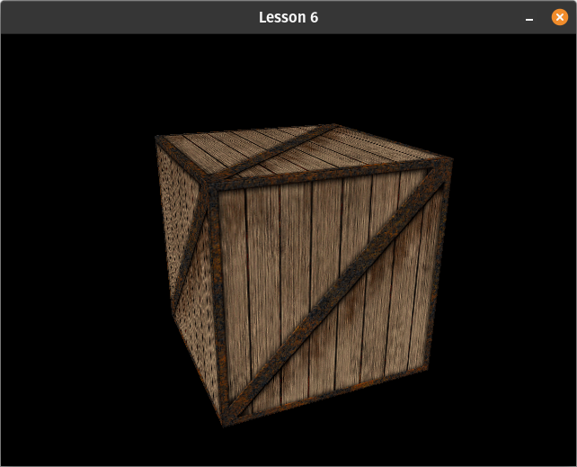 | 0.100.0 | [Robert Winkler](https://github.com/rswinkle) |
| [lesson7](webgl_lessons/lesson7.cpp) | 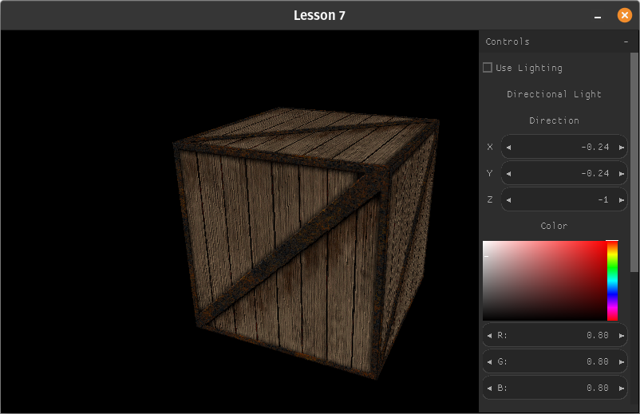 | 0.100.0 | [Robert Winkler](https://github.com/rswinkle) |
| [lesson8](webgl_lessons/lesson8.cpp) | 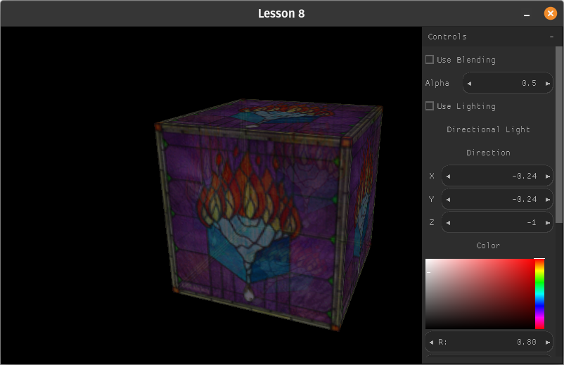 | 0.100.0 | [Robert Winkler](https://github.com/rswinkle) |
| [lesson9](webgl_lessons/lesson9.cpp) | 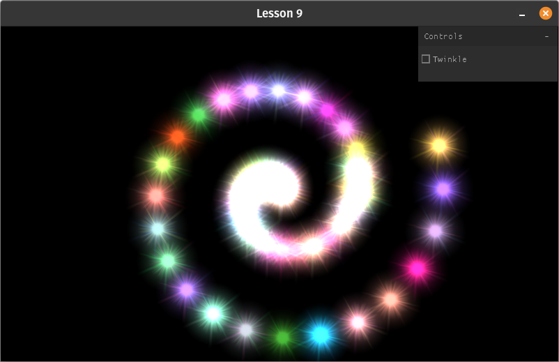 | 0.100.0 | [Robert Winkler](https://github.com/rswinkle) |
| [lesson10](webgl_lessons/lesson10.cpp) | 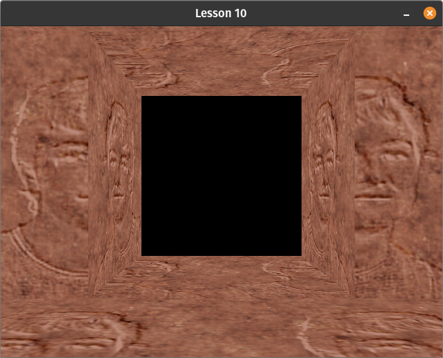 | 0.100.0 | [Robert Winkler](https://github.com/rswinkle) |
| [lesson11](webgl_lessons/lesson11.cpp) | 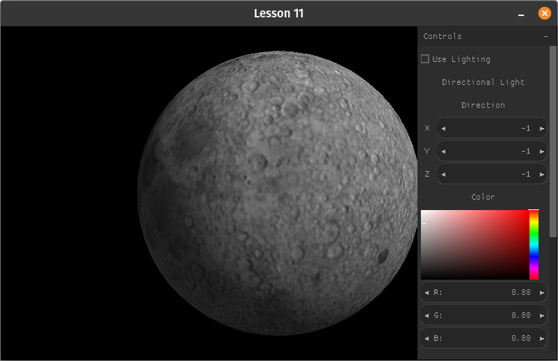 | 0.100.0 | [Robert Winkler](https://github.com/rswinkle) |
| [lesson12](webgl_lessons/lesson12.cpp) | 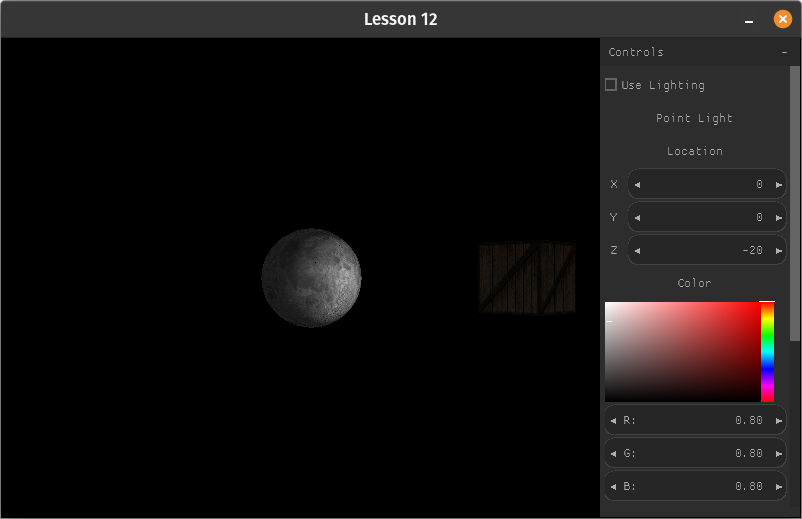 | 0.100.0 | [Robert Winkler](https://github.com/rswinkle) |
| [lesson13](webgl_lessons/lesson13.cpp) | 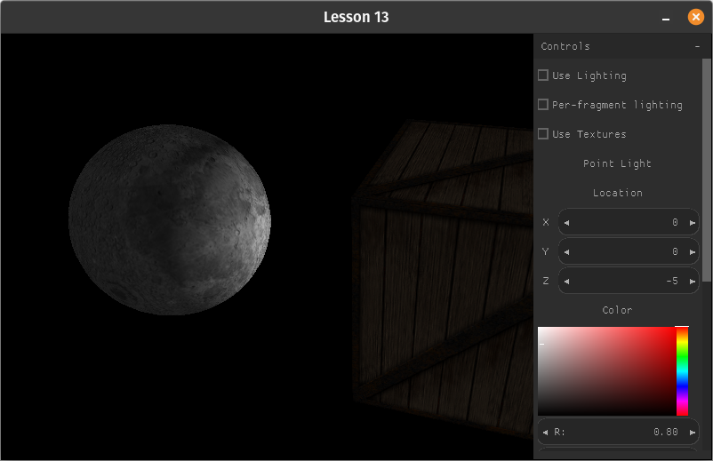 | 0.100.0 | [Robert Winkler](https://github.com/rswinkle) |
| [lesson14](webgl_lessons/lesson14.cpp) | 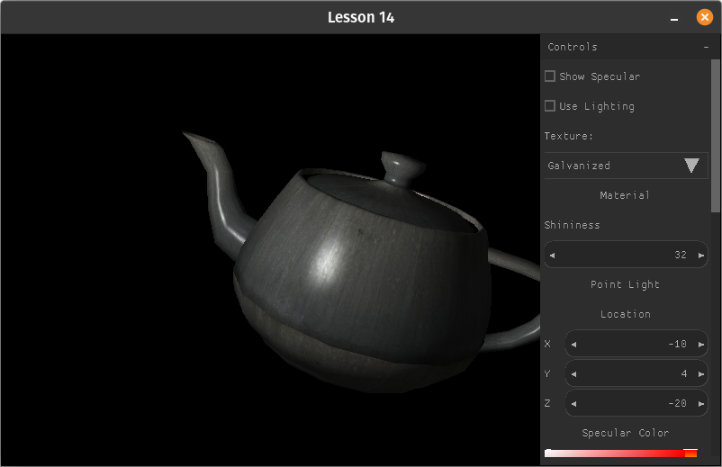 | 0.100.0 | [Robert Winkler](https://github.com/rswinkle) |
| [lesson15](webgl_lessons/lesson15.cpp) | 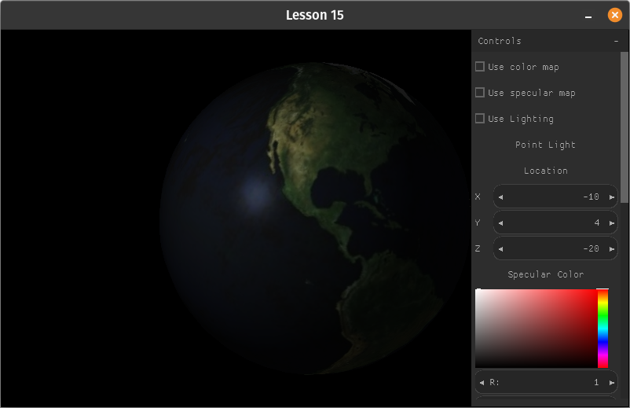 | 0.100.0 | [Robert Winkler](https://github.com/rswinkle) |
| [lesson16](webgl_lessons/lesson16.cpp) | 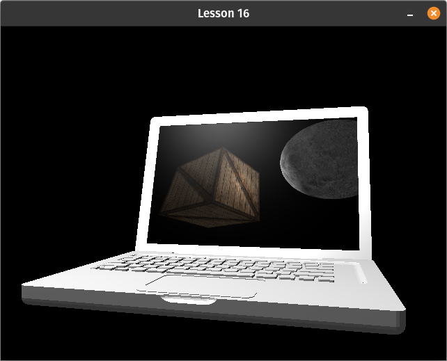 | 0.100.0 | [Robert Winkler](https://github.com/rswinkle) |

### Learn OpenGL ports

Ports of [learnopengl.com](https://learnopengl.com/) tutorial code [here](https://github.com/rswinkle/LearnPortableGL).

These are probably the cleanest and most polished examples because they were already OpenGL 3.3 so the porting process
was relatively easy with minimal.

The project is too large to include here and works best as a separate repo anyway. I've currently ported the first 4 chapters
worth, or about 56 programs out out of a total of about 97 programs over 8 chapters. It's mostly stalled there until
PGL officially adds certain features like more texture formats, FBOs, etc. I've included a few below as a sampling.

|  example  | image  | last version updated | original developer |
|-----------|--------|:-----------------------:|:----------------------|
| [spotlight](https://raw.githubusercontent.com/rswinkle/LearnPortableGL/master/src/2.lighting/light_casters_spot.cpp) |  | 0.100.0 | [Robert Winkler](https://github.com/rswinkle) |
| [model_loading](https://raw.githubusercontent.com/rswinkle/LearnPortableGL/master/src/3.model_loading/model_loading.cpp) | 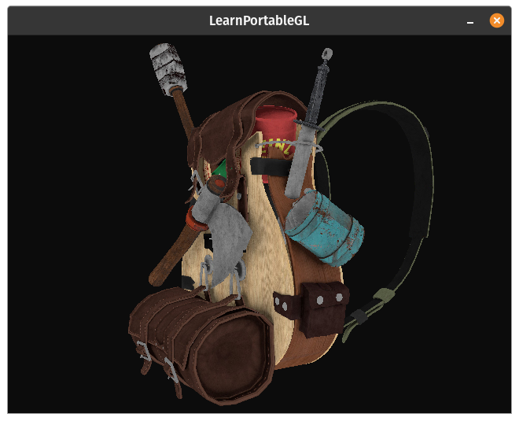 | 0.100.0 | [Robert Winkler](https://github.com/rswinkle) |
| [depth_testing_view](https://raw.githubusercontent.com/rswinkle/LearnPortableGL/master/src/4.advanced_opengl/depth_testing_view.cpp) | 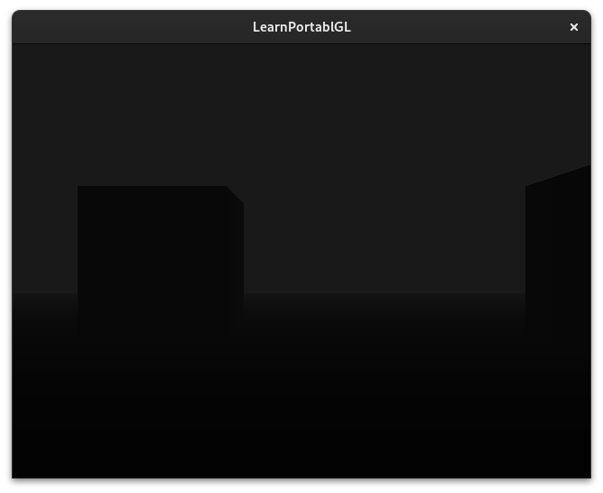 | 0.100.0 | [Robert Winkler](https://github.com/rswinkle) |
| [stencil_testing](https://raw.githubusercontent.com/rswinkle/LearnPortableGL/master/src/4.advanced_opengl/stencil_testing.cpp) | 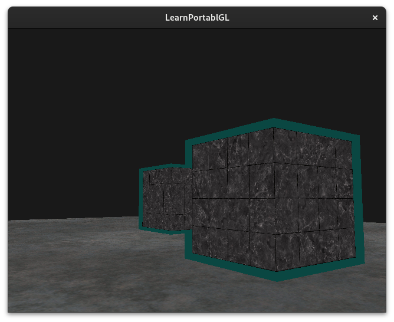 | 0.100.0 | [Robert Winkler](https://github.com/rswinkle) |
| [blending_discard](https://raw.githubusercontent.com/rswinkle/LearnPortableGL/master/src/4.advanced_opengl/blending_discard.cpp) | 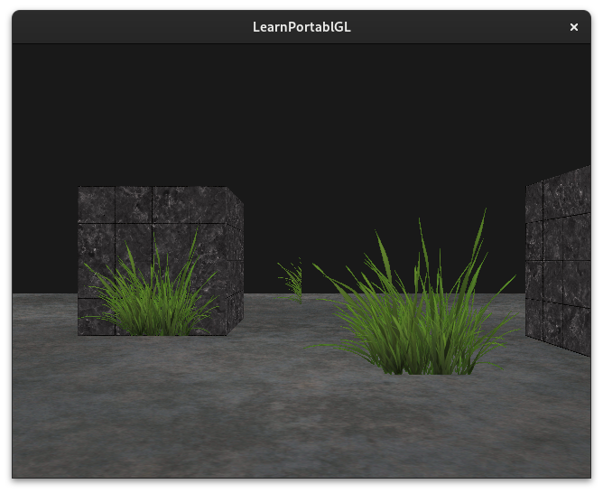 | 0.100.0 | [Robert Winkler](https://github.com/rswinkle) |
| [blending_sorted](https://raw.githubusercontent.com/rswinkle/LearnPortableGL/master/src/4.advanced_opengl/blending_sorted.cpp) | 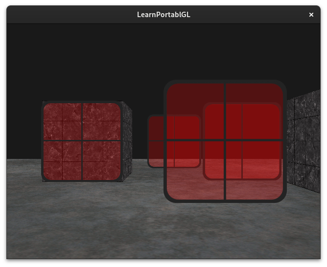 | 0.100.0 | [Robert Winkler](https://github.com/rswinkle) |

